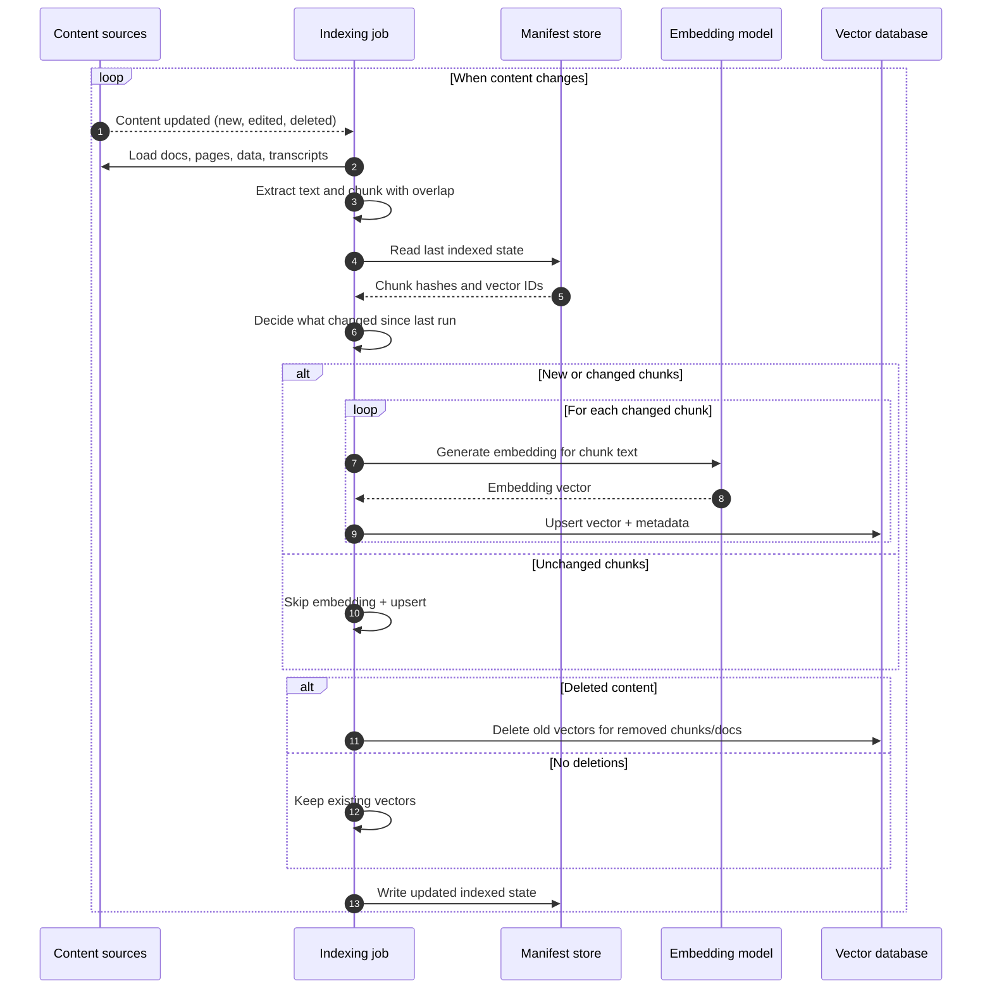
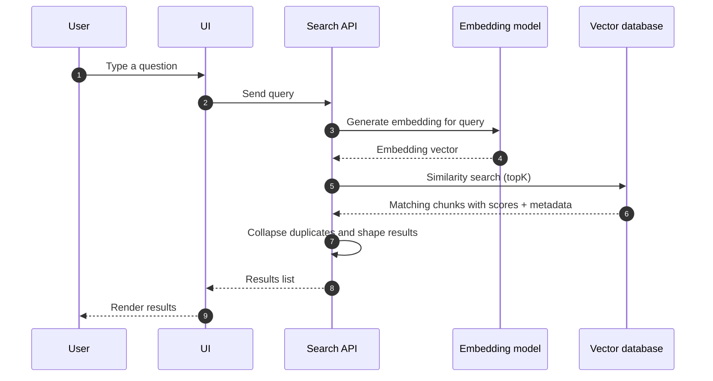

Over the last few weeks, I've been really impressed by the capabilities of our modern AI agents, especially [Cursor.com/agents](https://cursor.com/agents). Because it's been so easy to add new features and make changes (like [upgrading from Remix v2 to React Router v7](/blog/how-i-used-cursor-to-migrate-frameworks)), I decided to just throw all my open issues at it and see what it could do. And I've [closed them all](https://github.com/kentcdodds/kentcdodds.com/issues) (as of the time of this writing 😅).

I think most of us has a wish list of things we'd like to build in projects we really care about. Some of those things stay on the wish list because we don't have time to build them. Well now time is no longer an issue.

One of my biggest wish list items since I launched the updated site in 2021 was [semantic search](https://www.elastic.co/what-is/semantic-search) [(issue #5)](https://github.com/kentcdodds/kentcdodds.com/issues/5) (and it was [issue #107 on the old site](https://github.com/kentcdodds/old-kentcdodds.com/issues/107) opened back in 2019)!

Now the tools we have are so much more powerful and it makes building something like this basically trivial.

You can try it right now using the hotkey <kbd>/</kbd> to open the search bar and type "How did Kent get his first job?" or "What's the best way to learn React?" and hit <kbd>?</kbd> to see the keyboard shortcuts.

## Indexing

Here's an outline of the architecture I used to build indexing for semantic search. To do semantic search you have to index things into a [vector database](https://www.cloudflare.com/learning/ai/what-is-vector-database/) and I selected [Vectorize](https://developers.cloudflare.com/vectorize/) because Cloudflare has just put together the premium platform for building AI applications

Here's how I index the content (youtube videos, blog posts, pages, podcasts, etc.):



So I index using GitHub actions.

## Searching

And then when you search, I query the vector database:



All of this is powered by Cloudflare Workers AI (with AI Gateway) and Vectorize. It's phenominally easy to build with (especially when you have an agent doing most of the work 😅).

These are the two core code paths from my implementation (trimmed to the most important bits).

Let's take a look at some of the code that makes this all work.

### Indexing part 1: chunk + hash content

This is what makes incremental indexing practical. I chunk the source content, build a stable chunk ID, and hash each chunk payload.

```ts
// `source` is the full text content for one document (a single post/page/etc).
const chunkBodies = chunkTextRaw(source, {
	targetChars: 2500,
	overlapChars: 250,
	maxChunkChars: 3500,
})

for (let i = 0; i < chunkBodies.length; i++) {
	const chunkBody = chunkBodies[i] ?? ''
	const vectorId = `${docId}:chunk:${i}`
	const text = `Title: ${title}\nURL: ${url}\n\n${chunkBody}`
	const hash = sha256(text)

	nextManifestChunks.push({ id: vectorId, hash })
}
```

In this snippet, `source` is a string, not an object. For MDX-backed docs it's basically the full file contents. For YAML-backed sections or transcript-based content, I first build a synthetic text document, then treat that as `source`.

`chunkTextRaw` splits that string into overlapping chunks, trying to keep chunks near a target size (`targetChars`) while capping the max size (`maxChunkChars`). The overlap helps preserve context across boundaries so important info isn't accidentally split away from surrounding words.

Chunking is necessary because embedding models have input limits, and it also improves retrieval precision by matching the relevant section instead of a whole document. Stable IDs (`docId:chunk:i`) make updates and deletes deterministic, and hashing lets me skip unchanged chunks so I do not re-embed content unnecessarily (saves me money and makes indexing faster).

### Indexing part 2: use manifest to skip unchanged chunks

If the hash did not change, we skip embedding/upsert for that chunk.

```ts lines=5
const oldHashesById = new Map(
	(oldManifestDoc?.chunks ?? []).map((c) => [c.id, c.hash]),
)

if (oldHashesById.get(vectorId) === hash) continue

toEmbed.push({
	id: vectorId,
	text,
	metadata: { title, url, snippet: makeSnippet(chunkBody), chunkIndex: i },
})
```

### Indexing part 3: embed changed chunks + upsert vectors

Only changed chunks are embedded and sent to Vectorize. Then I write `nextManifestChunks` back to the manifest.

```ts
if (toEmbed.length) {
	// getEmbeddings: Array<text> -> Array<vector> (one embedding vector per input text)
	// https://gateway.ai.cloudflare.com/v1/{account_id}/{gateway_id}/workers-ai/{model}
	const vectors = await getEmbeddings({ texts: toEmbed.map((x) => x.text) })

	// https://api.cloudflare.com/client/v4/accounts/{account_id}/vectorize/v2/indexes/{index_name}/upsert
	await vectorizeUpsert({
		// vectorizeUpsert writes or replaces vectors in the index by `id`.
		vectors: toEmbed.map((item, i) => ({
			id: item.id,
			values: vectors[i],
			metadata: item.metadata,
		})),
	})
}
```

`getEmbeddings` calls Workers AI (through AI Gateway in my full implementation) and returns dense numeric vectors for each text input.

`vectorizeUpsert` sends those vectors to Vectorize. "Upsert" means "insert if new, update if existing" for a given vector ID.

### Search part 1: embed the query and fetch nearest matches

I overfetch chunk-level matches (`safeTopK * 5`, capped at 20), because several top chunks are often from the same document and I want more results.

```ts
// `K` means "how many nearest neighbors/results to return".
const safeTopK = Math.max(1, Math.min(20, Math.floor(topK)))
const rawTopK = Math.min(20, safeTopK * 5)

const [queryVector] = await getEmbeddings({ texts: [query] })

// https://api.cloudflare.com/client/v4/accounts/{account_id}/vectorize/v2/indexes/{index_name}/query
const { matches } = await queryVectorize({
	vector: queryVector!,
	topK: rawTopK,
	returnMetadata: 'all',
})
```

`queryVectorize` is the vector-search call. It sends the query embedding to the Vectorize API and gets back nearest neighbors (matches), each with a similarity score and metadata.

### Search part 2: collapse chunk matches into doc matches

Then because the same document can appear in the results multiple times, I build a canonical doc ID and keep only the best-scoring chunk per document.

```ts
const byDocId = new Map<string, SearchResult>()

for (const m of matches) {
	const type = typeof m.metadata?.type === 'string' ? m.metadata.type : 'doc'
	const slug = typeof m.metadata?.slug === 'string' ? m.metadata.slug : m.id
	const canonicalId = `${type}:${slug}`

	const existing = byDocId.get(canonicalId)
	if (!existing || m.score > existing.score) {
		byDocId.set(canonicalId, {
			id: canonicalId,
			score: m.score,
			title: m.metadata?.title as string | undefined,
			url: m.metadata?.url as string | undefined,
			snippet: m.metadata?.snippet as string | undefined,
		})
	}
}

return [...byDocId.values()]
	.sort((a, b) => b.score - a.score)
	.slice(0, safeTopK)
```

This was a really fun project and I've been really loving what Cloudflare has put together for building AI-powered apps. I've got more to share as well, but we'll stop here for now!
