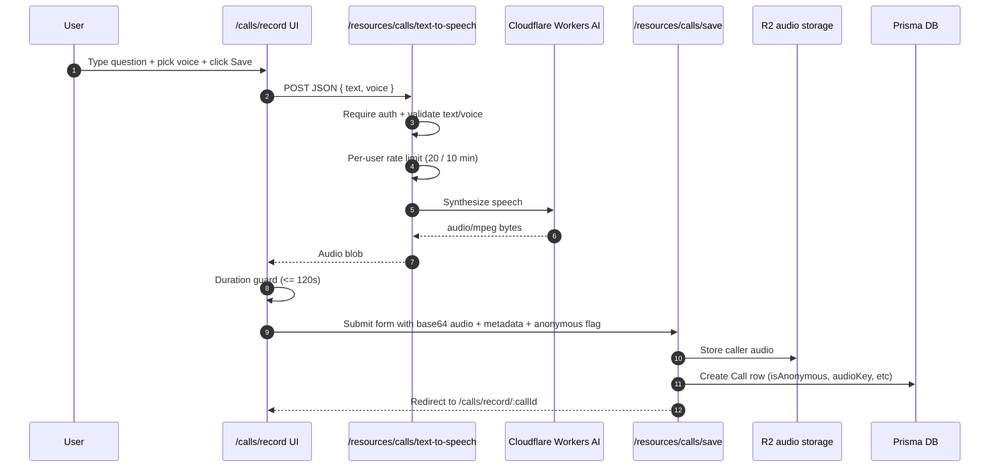
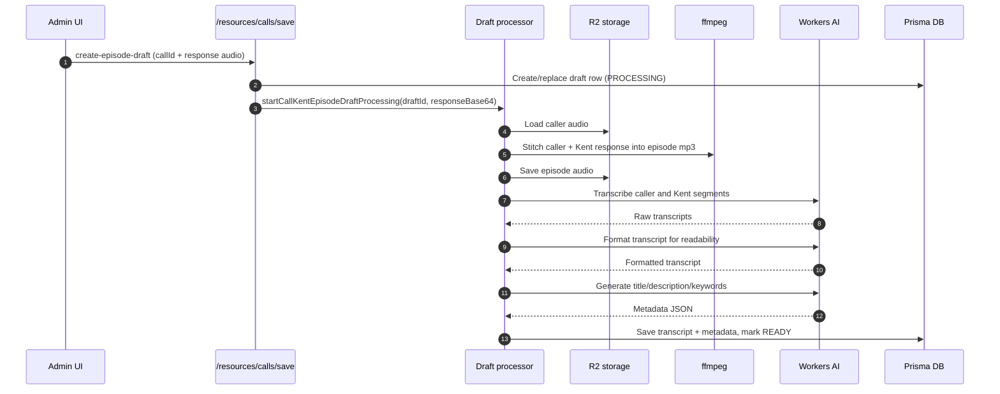

As I mentioned in [my other post](/blog/an-ai-powered-kentcdodds-com), I've added some pretty cool AI-powered features to kentcdodds.com and I want to tell you all about it.

In case you're unaware, since this site was launched in 2021, I introduced the [Call Kent Podcast](/calls) where I answer questions from the community. I've got over 200 episodes recorded and published so far.

The way it works is (as explained on [`/calls`](/calls)):

> You record your brief question (120 seconds or less) right from your browser. Then I listen to it later and give my response, and through the magic of technology (ffmpeg), our question and answer are stitched together and published to the podcast feed.

Another one of the wish list items I've had for a while is the ability for people to ask me questions or open discussion topics without having to record themselves.

I think some people are afraid to record themselves because English isn't their first language, or they're worried about the quality of their audio, they're worried about being judged, or they want to have more time to think about their question and work through their thoughts. On top of that, some people just want to be anonymous and not have their name or voice associated with the question.

So (thanks to the amazing agents for building and the Cloudflare AI platform), I've handled all of these things and more!

Now when you go to [`/calls/record`](/calls/record), you'll still be able to record yourself (with the cool waveform animation, [HT Jhey](/credits)), but you'll also have a little button to switch to a text input to type your question. You'll get to choose an AI voice to use for your question and that voice will be used to generate the audio for your question or discussion topic!

It's way cool. [Try it out!](/calls/record)!

Oh, and once you've selected your voice (or recorded yourself), you can also choose whether you want to be anonymous or not. If you want to be anonymous, you can just click the "Anonymous" checkbox and a generic Kody avatar will be used in the episode artwork instead of your photo.

But that's not all! On my side of things, I can listen to your audio, record my response, and then our conversation transcript and metadata is automatically generated for me (I can edit it if I like). This makes the resulting episode more useful for everyone and saves me a lot of time.

## How it's built

Here's the architecture for the text-to-speech caller flow on [`/calls/record`](/calls/record):



## The text-to-speech endpoint

This route does a few important things before calling Workers AI:

- Validates question text + voice choice
- Adds an AI disclosure prefix (if missing)

Then it calls Workers AI through Cloudflare AI Gateway:

```ts
export const AI_VOICE_DISCLOSURE_PREFIX = `This caller's voice was generated by AI.`

// Cloudflare AI Gateway -> Workers AI:
// https://gateway.ai.cloudflare.com/v1/{account_id}/{gateway_id}/workers-ai/{model}
const generated = await synthesizeSpeechWithWorkersAi({
	text: withAiDisclosurePrefix(questionText.trim()),
	voice: selectedVoice,
	model: getEnv().CLOUDFLARE_AI_TEXT_TO_SPEECH_MODEL, // I'm using `@cf/openai/deepgram/aura-2-en`,
})
```

## Draft episode automation (my side)

After I record a response in the admin UI, the server starts a background draft-processing pipeline:



The code path is in `startCallKentEpisodeDraftProcessing`, and it updates a `step` field as it goes:

```ts lines=3,10,17,24
await prisma.callKentEpisodeDraft.updateMany({
	where: { id: draftId, status: 'PROCESSING' },
	data: { step: 'GENERATING_AUDIO', errorMessage: null },
})

// createEpisodeAudio(...) + putEpisodeDraftAudioFromBuffer(...)

await prisma.callKentEpisodeDraft.updateMany({
	where: { id: draftId, status: 'PROCESSING' },
	data: { step: 'TRANSCRIBING', errorMessage: null },
})

// transcribeMp3WithWorkersAi(...) + formatCallKentTranscriptWithWorkersAi(...)

await prisma.callKentEpisodeDraft.updateMany({
	where: { id: draftId, status: 'PROCESSING' },
	data: { step: 'GENERATING_METADATA', errorMessage: null },
})

// generateCallKentEpisodeMetadataWithWorkersAi(...)

await prisma.callKentEpisodeDraft.updateMany({
	where: { id: draftId, status: 'PROCESSING' },
	data: { status: 'READY', step: 'DONE' },
})
```

And this is the part where `ffmpeg` actually does the stitch/normalize work:

{/* prettier-ignore */}
```ts
const responseAudio = parseBase64DataUrl(responseBase64).buffer
const created = await createEpisodeAudio(callAudio, responseAudio)

// In createEpisodeAudio(...)
const args = [
	'-i', introPath,
	'-i', callPath,
	'-i', interstitialPath,
	'-i', responsePath,
	'-i', outroPath,
	'-filter_complex', '...silenceremove + loudnorm + acrossfade...',
]
spawn('ffmpeg', args, { stdio: 'inherit' })
```

One implementation detail worth calling out: the admin form sends response audio as a base64 data URL (`responseBase64`), and for the `@cf/openai/whisper-large-v3-turbo` model the Workers AI transcription endpoint expects base64 in JSON. In code:

```ts lines=5
const isWhisperLargeV3Turbo = model.includes('whisper-large-v3-turbo')
const body = isWhisperLargeV3Turbo
	? JSON.stringify({
			// `whisper-large-v3-turbo` expects base64 in the JSON payload.
			audio: Buffer.from(mp3Body).toString('base64'),
			language: 'en',
			vad_filter: true,
		})
	: mp3Body
```

For `@cf/openai/whisper` (non-turbo), raw binary `audio/mpeg` works, so base64 is model-specific here, not a universal requirement for every transcription call.

I use the turbo path here specifically because it lets me include instruction/context fields (like `initial_prompt`) alongside the audio, which helps with proper nouns and overall transcript quality for this podcast format.

> Only use information that is explicitly present in the provided transcripts and/or caller notes.
> Do NOT invent details (names, companies, sponsors, products, locations, links).
> If you are unsure about a detail, omit it rather than guessing.

So by the time I hit publish, I usually have a full draft (audio, transcript, title, description, keywords) that I can edit quickly instead of creating everything manually.

## Conclusion

Building AI-powered apps using AI-powered tools is fantastic. I've been able to build so many things that I never had the time to build otherwise, and I'm hopeful that these new features in the Call Kent podcast will make it easier for you to ask me questions and open discussion topics!

See you in the calls!
