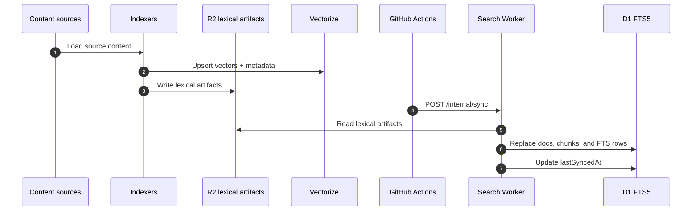
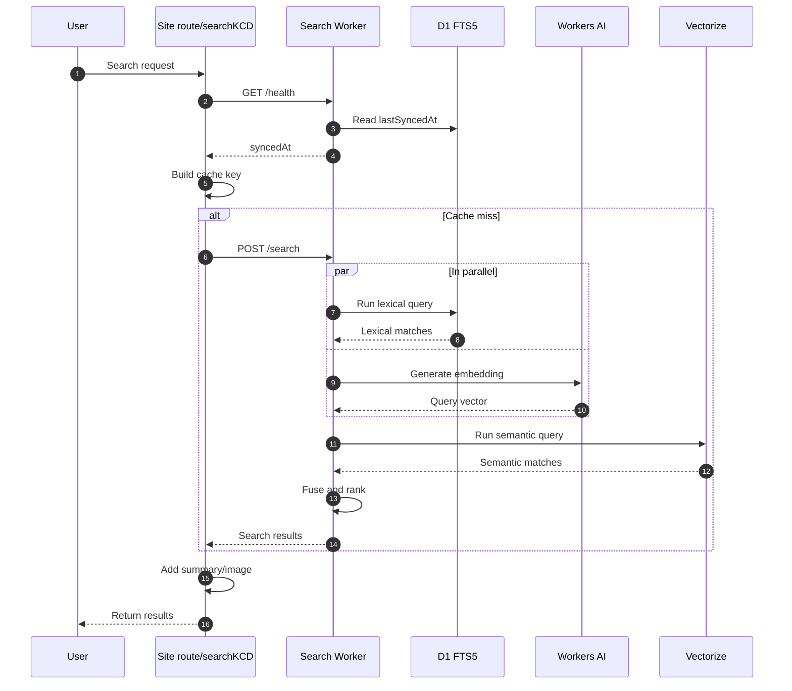

A few weeks ago I [added semantic search to kentcdodds.com](/blog/building-semantic-search-on-my-content). It lets you search with natural-language questions like ["How did Kent get his first job?"](/search?q=How+did+Kent+get+his+first+job?) or ["What's the best way to learn React?"](/search?q=What's+the+best+way+to+learn+React?) and get genuinely relevant results instead of a keyword-match list. I was pretty happy with it.

But it wasn't good enough.

The most glaring failure: searching for "React Testing Library" didn't even surface the original [introduction post](/blog/introducing-the-react-testing-library). That's the canonical piece on the topic. It should be the first result. Pure semantic search missed it entirely because the embedding model weighted the conceptual meaning of "React Testing Library" over the literal title match.

What followed was three rounds of design, build, ship, regret, and redesign. This post is about all of it.

## The Problem With Pure Vector Search

Semantic (vector) search works by turning text into a dense numerical representation and finding other content whose representation is geometrically close. This is powerful for intent-based queries. "How do I avoid testing implementation details?" will find relevant posts even if they don't contain those exact words.

But it has a blind spot: exact terms. Things like:

- Library names (`React Testing Library`, `Remix`, `React Router`)
- API identifiers (`useState`, `loader`, `action`, `useFetcher`)
- Error messages and version numbers
- Names and product titles

There's a well-established complement: **lexical search**. Instead of matching by meaning, it matches by the actual words. It builds an inverted index and ranks results using formulas like BM25 that reward documents where the query terms appear often and prominently.

| Approach   | Strong at                            | Weak at                         |
| ---------- | ------------------------------------ | ------------------------------- |
| Semantic   | Natural language, intent, paraphrase | Exact identifiers, proper nouns |
| Lexical    | Exact terms, titles, API names       | Fuzzy/intent queries, synonyms  |
| **Hybrid** | **Both**                             |                                 |

You don't have to choose. Run both, then merge and re-rank the candidates.

## Round 1: Building Hybrid Search

### Choosing an approach

My first question was whether I needed to build this myself or whether an existing service would handle it. I talked it through with the agent and had it research how Cloudflare AI Search actually works. The conclusion was that it's oriented toward "index my website" scenarios, not custom multi-source pipelines with YouTube timestamps, podcast metadata, MDX frontmatter, and per-source ignore lists. Not a fit.

So I stayed with my existing Vectorize-based semantic search and added lexical retrieval alongside it. For the lexical index, my first instinct was SQLite `FTS5`, a built-in SQLite extension that gives you BM25-ranked full-text search with minimal ceremony. The agent suggested this approach and also that because my site already had a SQLite cache database replicated across app instances via LiteFS, it seemed like a natural fit: no new infrastructure, no new service, no new billing.

The high-level design was:

1. Indexers emit **lexical artifacts** (JSON files with the searchable chunk text and metadata) to R2 alongside the existing vector manifests.
2. The app syncs those artifacts into a local FTS5 index.
3. At query time, lexical and semantic retrieval run in parallel, then merge via Reciprocal Rank Fusion.

That design worked fine in development. The agent built and tested it just fine as well. Production had other ideas, but we'll get to that.

### The workflow with Cursor and GPT-5.4

The entire first implementation was built using Cursor with GPT-5.4. There was also an implementation plan file that the agent generated and then executed against.

This wasn't a "write me the code" prompt. The workflow was iterative:

1. **Investigate:** I asked the agent to learn everything it could about how the existing semantic search worked.
2. **Diagnose:** I asked why results might not be as good as they could be. The agent ranked five reasons by practical impact. Pure vector search was #1.
3. **Explore alternatives:** We talked through lexical search, hybrid retrieval, and whether Cloudflare had a managed option worth using.
4. **Plan:** The agent proposed an implementation plan, asked two clarifying questions, and generated a concrete to-do list.
5. **Implement:** The agent worked through the to-dos: schema, indexer changes, artifact sync, hybrid runtime, replication handling, test coverage.
6. **Verify:** I asked it to confirm data was landing correctly. It queried the local index and showed me the results.
7. **Deploy:** After deploying, I asked it to trigger the three GitHub Actions index jobs.

The whole thing required about **20 minutes of my personal attention**. I was happy with it. Maybe a little too confident.

### A bug Agent Review caught

Before deploying, I ran Cursor's built-in **Agent Review** feature. It surfaced a subtle regression in the YouTube timestamp code:

```ts
// Before the fix
if (!t) return url // t=0 is falsy, so 0-second timestamps were silently dropped

// After the fix
if (t === null) return url // only skip when timestamp is genuinely absent
```

YouTube transcript chunks at the very beginning of a video weren't getting the deep-link parameter added. The kind of falsy-zero edge case that's easy to miss. The agent caught it, added a regression test, and verified the fix. I wouldn't have caught that before shipping.

## Round 2: The Production Failure

### What went wrong

The first sign something was wrong came from the UX. A novel search query (one that had never been cached) would hang for several seconds, then return a 500. That's bad enough. But then I noticed that while that request was in flight, **unrelated page loads in other tabs on the same app instance also hung** until the search request resolved ‼️

Search was blocking the entire server.

The root cause was an architectural mistake I hadn't thought through carefully enough. The lexical sync logic (the code that fetched JSON artifacts from R2 and imported them into the SQLite FTS5 index) was **coupled to the foreground search request path**. The first time a fresh instance searched, it would block on that import before returning results.

What made it block everything else: Node's SQLite driver's `DatabaseSync` API is synchronous and single-threaded. Any other concurrent request that tried to read from the same database would queue behind it. And because my site caches heavily and I had decided to put the lexical index in the same cache database, a cold-path sync stalled the whole process. On a Node.js server handling multiple requests, a 200-300ms synchronous DB write stalls everything else.

The evidence was measurable:

```
lexical source replace committed  { sourceKey: "repo-content.json",  durationMs: 71  }
lexical source replace committed  { sourceKey: "podcasts.json",      durationMs: 70  }
lexical source replace committed  { sourceKey: "youtube.json",       durationMs: 75  }
primary lexical sync finished     { durationMs: 273 }
```

A blocking probe confirmed the user-visible impact: a cold lexical search took ~300ms while a concurrent "fast" (non-search) request spent ~160ms blocked behind it. Once warm, the fast request dropped to under 1ms. The sync was the problem.

This wasn't a "search is slow" problem. It was a request-path ownership problem. Derived-index maintenance had no business happening inside a foreground user request or even on the web server at all.

### Fixing it: a dedicated Cloudflare Worker

So I fired up a new agent conversation and the agent and I worked through several options. We could prewarm on startup, use a background interval, or move lexical work to a local worker thread. All of those fixes kept the work on the app server, and I didn't want lexical search affecting site performance at all.

That narrowed it to one real option: move lexical search off the app server entirely.

The fix was a dedicated [Cloudflare Worker](https://workers.cloudflare.com) service that owned the entire lexical search stack, with its own Cloudflare D1 database for the FTS5 index. The app server would talk to it over HTTP with a timeout and graceful degradation to semantic-only results on failure.

The new worker exposed a small API: a query endpoint, an admin sync endpoint, and a handful of admin/delete routes for operational visibility. R2 stayed the source of truth for lexical artifacts; the Worker synced from R2 into D1 after the indexer jobs ran. The site only queried the worker over HTTP.

One thing I've noticed about GPT-5.4: it loves fallbacks. Every time it implements something, it reaches for a graceful-degradation path, a local alternative, a "if the remote fails, do this instead." Sometimes that's a good instinct. In this case it was actively harmful: the agent had left a local SQLite fallback in place, which was exactly what had caused the failure, and would have let the problem creep back in.

So we removed the local lexical module from the site entirely and switched local development to use an MSW-mocked Worker HTTP boundary. Dev and test now go through the same fetch path as production, just intercepted by the mock. That closes the door on future regressions.

Deployed this and the blocking issue and CPU spikes were gone. Victory!

## Why That Still Bothered Me

The dedicated lexical worker solved the production failure. But after living with it for a day, I was still unhappy.

The system now had two completely separate search stacks:

- The site ran `semanticSearchKCD`, which did embedding, Vectorize query, and score fusion in app-server code.
- A separate lexical worker sat beside it.
- Two deploy workflows, two worker configs, separate env vars, separate monitoring, separate test surfaces.

The admin UI for the lexical worker added more surface that didn't feel worth maintaining. And the split made the code feel like two features bolted together rather than one coherent search system.

The real question was: why was any of the search logic running in the app server at all? The site is a Remix/React Router app whose job is to serve pages. The embedding call, the Vectorize query, the score fusion. None of that belonged in the app server. It was there because that's where the original semantic search lived, and we added lexical search alongside it without questioning the ownership model.

## Round 3: One Search Worker

I went back to Cursor and asked it to undo the split and unify everything behind a single worker. I was explicit about the constraints:

- No lexical admin interface
- The site should talk to one endpoint, period
- The worker owns embeddings, Vectorize, lexical FTS, and fusion
- Local dev should mock the worker HTTP boundary, not run any of the search logic in-process

### The workflow

The agent inspected the existing lexical worker, traced all the semantic search code in the site, designed the new unified worker, and got to work. A few things came up during the process worth calling out.

**AI bindings vs HTTP calls.** The original implementation was calling AI Gateway via HTTP from the app server (with a `fetch` to `gateway.ai.cloudflare.com`). Inside a Worker, you can instead use the Workers AI binding and route it through AI Gateway with a single option:

```ts
await env.AI.run(
	model,
	{ text: [query] },
	{
		gateway: { id: env.CLOUDFLARE_AI_EMBEDDING_GATEWAY_ID },
	},
)
```

This is cleaner than hand-rolling an HTTP call. You still get AI Gateway's rate limiting and observability, but the Worker code doesn't need Cloudflare API credentials at all. D1, R2, Vectorize, and AI are all bindings. The only secret the Worker needs is `SEARCH_WORKER_TOKEN` for callers authenticating to the Worker's HTTP boundary.

**The shared package.** The worker and the site both needed to agree on the `SearchResult` type, error classes, and doc-ID canonicalization logic. Rather than repeating that across modules, we extracted it into a small internal workspace package at `services/search-shared` (`@kcd-internal/search-shared`). This avoided long relative imports and made the coupling explicit.

**The review loop.** The PR went through a few rounds of CodeRabbit and Cursor BugBot feedback. Most of the actionable items were about hardening: better error handling for malformed JSON in sync requests, memoizing schema initialization per D1 instance, parsing sync body more defensively, normalizing URL keys consistently between the worker and the shared package, and fixing a test whose assertion was inverted relative to its name. Not architecture changes, but the difference between something that works and something that's operationally sound.

The PR is [#739](https://github.com/kentcdodds/kentcdodds.com/pull/739) if you want to see the full diff and review history.

## How It Works Now

Here's the shape of what actually shipped...

First, here's the indexing and sync flow that keeps the worker's lexical data up to date:



And here's the runtime query flow when someone actually performs a search:



### Lexical artifacts

The three indexer scripts already produced manifests and vectors. They now also produce **lexical artifacts**: JSON files written to R2 with keys like `lexical-search/repo-content.json`.

Each artifact is an array of chunks with the full searchable text plus metadata: title, URL, type, snippet, and for YouTube: `startSeconds`, `endSeconds`, `imageUrl`. These are separate from the vector manifests. The manifests track what's in Vectorize. The artifacts are the raw searchable text for the FTS index.

### The search worker

`services/search-worker` is a Cloudflare Worker that owns the full runtime query path. It exposes two main endpoints:

- `POST /search`: takes `{ query, topK }`, returns ranked `SearchResult[]`
- `POST /internal/sync`: pulls fresh artifacts from R2 into D1 (called by GitHub Actions after indexing completes)

Internally, the worker uses four Cloudflare bindings:

- `SEARCH_DB`: D1 database, holds the FTS5 lexical index
- `SEARCH_INDEX`: Vectorize index, holds the semantic vector embeddings
- `SEARCH_ARTIFACTS_BUCKET`: R2 bucket, holds the lexical artifacts from the indexers
- `AI`: Workers AI binding for generating embeddings

When a query comes in, the worker starts the lexical FTS query and the embedding call in parallel, then issues the Vectorize query after the embedding resolves, and fuses the results:

```ts
// lexical starts immediately
const lexicalMatchesPromise = dependencies.queryLexicalMatches({
	query,
	topK: rawLexicalTopK,
})

// embedding and lexical run in parallel
const [vector, lexicalMatches] = await Promise.all([
	dependencies.getEmbedding({ text: cleanedQuery, model }),
	lexicalMatchesPromise,
])

// Vectorize query after embedding
const semanticMatches = await dependencies.queryVectorize({
	vector,
	topK: rawSemanticTopK,
})

// fuse both result sets
return fuseRankedResults({ semanticResults, lexicalResults, topK: safeTopK })
```

Lexical matches get a slight boost in the fusion (1.15x weight vs semantic's 1.0) since exact-match signals are harder to get right and more reliable when present.

### The site boundary

The site now has a single thin client that talks to the search worker:

```ts
// search.server.ts
const health = await getSearchWorkerHealth().catch(() => null)
const cacheKey = makeSearchCacheKey({
	query: cleanedQuery,
	topK: safeTopK,
	workerUrl,
	searchVersion: health.syncedAt ?? 'never-synced',
})
const baseResults = await cachified({
	key: cacheKey,
	getFreshValue: fetchResults,
})
```

The cache key includes `syncedAt` from the worker health endpoint. That means cached results automatically invalidate when the lexical index is updated by an indexer run, without needing any explicit cache purge logic.

The site no longer does any embedding, vector querying, or score fusion. It just calls the worker and caches the result.

### The shared package

`services/search-shared` (`@kcd-internal/search-shared`) exports the `SearchResult` type, `SearchQueryTooLongError`, `normalizeSearchQuery`, and the canonical doc-ID logic. Both the worker and the site import from it. That keeps the search contract consistent across the boundary without long relative paths or copy-paste drift.

### Relevance filtering and `noCloseMatches`

After RRF fusion, the worker applies a confidence step in `filterFusedResultsByConfidence` (`services/search-worker/src/search-results.ts`): **`SEARCH_CONFIDENCE_MIN_BEST_SCORE`** (default `0.013`) rejects queries whose best fused score is below that floor, and **`SEARCH_CONFIDENCE_RELATIVE_RATIO`** (default `0.5`) drops hits scoring below half of the top fused score (the top hit always survives when it clears the floor). The worker’s `/search` JSON includes **`noCloseMatches: true`** when candidates existed but none passed—distinct from an empty index. See `docs/agents/search-relevance.md` for tuning notes.

## What I Learned

The search quality improvement was straightforward once the design was right. Exact terms like "React Testing Library" now surface the right content. Searching for API names and library identifiers works reliably. That part held up from the first implementation.

The harder lessons were operational:

**Request-path ownership matters.** Don't let derived-index maintenance happen inside a foreground user request. Whether you use SQLite, a managed service, or something else, keeping a search index fresh is background work and should stay off the user-facing path.

**Split architectures carry hidden cost.** Two workers, two deploy pipelines, two sets of env vars, two test surfaces. It works, but it grates. When a feature crosses two different execution contexts, it's worth asking early whether the split is load-bearing or accidental.

**AI agents make redesigns cheap.** The reason I could go through three rounds of "build, ship, regret, redesign" in a matter of days is that the agent did most of the implementation work. I spent time on the decisions: is this design right? Does this feel too complex? What's the actual constraint here? The agent handled the mechanical execution of those decisions. That's a fundamentally different relationship with your codebase than doing all of it by hand. When redesigns are cheap, you can actually do them instead of living with regret.
