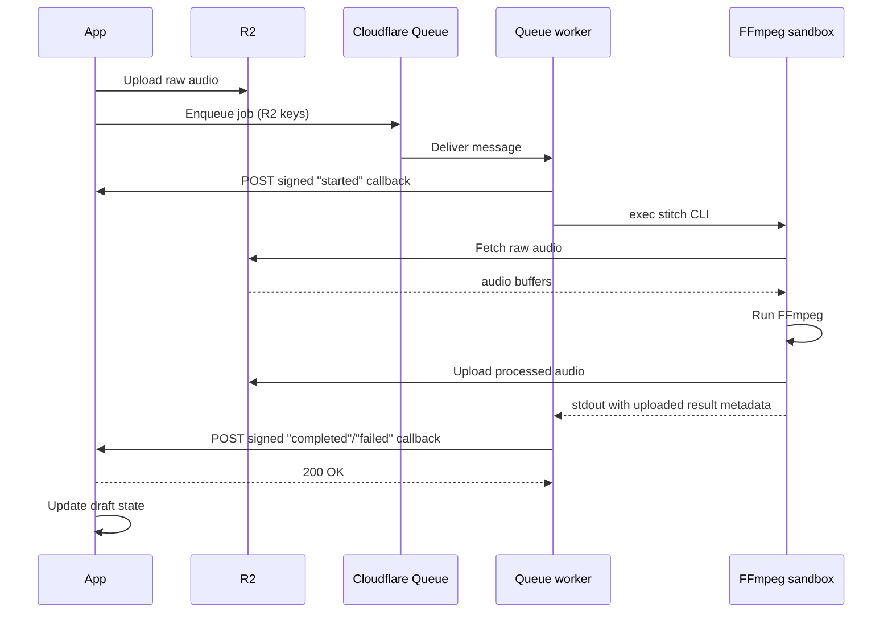

For 226 episodes of my [Call Kent podcast](/calls), I recorded audio, combined
it with my response audio, and ran the whole thing through FFmpeg directly on
the same Fly.io machine that serves kentcdodds.com. It was a simple pipeline
and it worked fine. But in the back of my mind I knew I should probably give
this some proper treatment (queues etc).

## The publish that finally broke things

On March 6, 2026, I finished
[an extra long recording](https://kentcdodds.com/calls/05/26/what-to-learn) a
Call Kent episode and hit publish. My app runs FFmpeg during the publish flow:
it stitches the caller's audio with my response, applies silence trimming,
normalizes loudness, adds intro and outro bumpers, and produces the final
episode MP3. That job used to block the HTTP request and run inline on the app
server.

It wasn't a big deal because I'm the only person who kicks that off so I don't
mind waiting for it to finish.

But this one was kinda big relative to others I've done and that publish made
production fall over.

The Fly.io instance running kentcdodds.com hit extreme CPU saturation. The
metrics tell the story clearly:


Load average climbed to **400–500%** and stayed there for the entire FFmpeg
run. The CPU quota balance graph showed the machine being throttled, having
consumed its allocated CPU budget so the scheduler was pulling it back. The
site was degraded until the job finished, and I had to emergency-upgrade the
machine from a shared CPU to a performance CPU to stabilize it.

That was the moment I decided to stop doing FFmpeg on the primary machine.

## In defense of the original design

I want to be clear: running FFmpeg inline was not a foolish decision. It was a
reasonable simple-first choice that served 226 episodes with minimal incident.

Only I can trigger that code path. It runs exactly once per episode. When I
started building the Call Kent feature, I could have designed a proper job
queue with a dedicated worker pool. But that would have been solving a
scalability problem I did not yet have. "Start simple and iterate when reality
tells you to" is still how I think about this. Reality finally told me.

The old design also had a characteristic that made it deceptively safe for a
long time: it ran on the same machine that handled everything else, which meant
the machine was already sized for general web traffic. FFmpeg just piggybaacked
on that capacity. The problem only surfaced when the audio was long enough and
the shared CPU quota tight enough to cause a collision.

Another nice benefit of me waiting is that now we have Cloudflare Queues and
Sandboxes to use (had I solved this earlier, I would have had to build my own
queue/worker runtime or found another solution that I don't like as much).

## Why the primary machine was the worst place for this

kentcdodds.com runs on Fly.io with a primary instance and read replicas. The
primary machine handles all write operations. The replicas handle reads. That
asymmetry matters here.

When FFmpeg ran on the primary machine, it competed with the one machine that
could not afford to be slow. If the primary stalls or throttles, writes stall.
Users trying to submit forms, save data, or do anything stateful hit that
bottleneck. The replicas were fine. The one machine that needed to be
responsive was the one eating all the CPU.

The tricky thing is, I can't run this on replicas because they are read-only and
I need to write to the primary machine to update the draft status etc. So yeah,
it's the worst place, but it's also the only place... Unless I move the whole
process somewhere else.

## The new architecture

The fix was to move the FFmpeg work entirely off the primary app server and
onto Cloudflare. Here is what the flow looks like now:



When a Call Kent episode is submitted, the app enqueues a job to a Cloudflare
Queue with the draft ID and the R2 object keys for the caller audio and my
response audio. The app then returns immediately. No more blocking on FFmpeg.

A Cloudflare Worker consumes the queue message, POSTs a signed `started`
callback to the app, then creates signed R2 download/upload URLs and runs a
small stitch CLI inside a Cloudflare Sandbox with `exec()`. The sandbox pulls
the audio files from R2, runs the FFmpeg stitching pipeline, uploads the
outputs back to R2, and returns the result metadata to the worker. The worker
then POSTs the signed `completed` or `failed` callback to the app. The app
verifies the signature and advances the draft through its processing steps:
`GENERATING_AUDIO` → `TRANSCRIBING` → `GENERATING_METADATA` → `DONE`.

The admin UI now shows incremental progress labels like "Generating episode
audio…" and "Transcribing audio…" instead of hanging on a single blocking
request. From my perspective as the only person using this flow, it feels much
nicer.

The transcription and metadata generation steps still run on the primary app
server after the callback comes in. There's an argument for moving those into
the queue/worker pipeline too (they're also compute-heavy and could benefit
from the same isolation), but that's a future refactor. The immediate problem was
FFmpeg, and solving the immediate problem first is the right call.

Here is the core enqueue call from the app side:

```ts
// app/utils/call-kent-audio-processor.server.ts
const res = await fetch(
	`${env.CALL_KENT_AUDIO_CF_API_BASE_URL}/accounts/${env.CLOUDFLARE_ACCOUNT_ID}/queues/${queueId}/messages`,
	{
		method: 'POST',
		headers: {
			Authorization: `Bearer ${env.CLOUDFLARE_API_TOKEN}`,
			'Content-Type': 'application/json',
		},
		body: JSON.stringify({
			content_type: 'json',
			body: { draftId, callAudioKey, responseAudioKey },
		}),
		signal: AbortSignal.timeout(10_000),
	},
)
```

And the signed callback route on the app side:

```ts
// app/routes/resources/calls/episode-audio-callback.ts
const signature = request.headers.get('X-Signature')
if (!verifyCallKentAudioProcessorCallbackSignature(signature, rawBody)) {
	return new Response('Invalid signature', { status: 401 })
}
const event = parseCallKentAudioProcessorEvent(rawBody)
await handleCallKentAudioProcessorEvent(event)
return Response.json({ ok: true })
```

The signature uses HMAC-SHA256 with a shared secret, verified with a
timing-safe comparison to avoid leaking information through response time.

## The before/after comparison

Here is what today's run looked like on the same primary Fly.io machine, after
the offload was in place:


Load average peaked around **60–80%** during the episode processing window.
There was no CPU throttling event. Memory was stable. The primary machine
stayed healthy for the entire duration of the job.

That is roughly an 85% reduction in peak load for the app server during
episode processing. The FFmpeg job itself takes about the same amount of time.
It is just happening somewhere else now.

March 6 (400–500% load, throttled) versus March 9 (60–80% load, stable). Same
machine, same app. The only difference is whether FFmpeg ran on it.

Worth noting: the March 9 episode was also considerably shorter than the March
6 one, and it ran on the default `lite` container instance (1/16 vCPU, 256 MiB
memory), which I have since upgraded to `standard-1` (1/2 vCPU, 4 GiB memory)
to give longer episodes more headroom. So the primary machine metrics would
likely look even cleaner on a longer episode now.

If you want to help me test that out, [go ahead and make a call](/calls). I
genuinely listen to and respond to all of them (you can even type your question
and choose an AI voice if you don't want to record yourself).

## What this cost

I want to be honest about the cost story rather than just saying "Cloudflare is
cheaper."

The real question is what the alternative looks like. If I wanted to isolate
FFmpeg on Fly.io, I would need a dedicated machine. A Fly.io `performance-1x`
machine is about
[$31/month](https://fly.io/docs/about/pricing/) if it stays running all the
time, plus storage and egress. If I aggressively auto-stop the machine when no
jobs are pending, the cost drops significantly, but now I am managing machine
lifecycle myself, and cold start time becomes a concern for a job that blocks a
publish flow.

With Cloudflare, the cost shape is different. You mostly pay when the sandbox
is actually running:

- [Cloudflare Queues](https://developers.cloudflare.com/queues/platform/pricing/)
  charges per operation. Three operations per message (write, read, delete). At
  the scale of a personal podcast, queue costs are essentially zero. The
  included 1 million ops/month covers thousands of episodes. Basically free.
- [Cloudflare Sandboxes](https://developers.cloudflare.com/sandbox/)
  still run in containers under the hood, but the programming model is much
  nicer for this case: the worker can `exec()` a single CLI command and wait
  for the result instead of fronting a long-lived HTTP service.
- [Cloudflare Workers](https://developers.cloudflare.com/workers/platform/pricing/)
  and [Durable Objects](https://developers.cloudflare.com/durable-objects/platform/pricing/)
  are still worth understanding because Sandboxes build on top of those pieces.

For a podcast publishing a few episodes a month with lots of idle time between
runs, Cloudflare scales to zero cleanly. The container does not cost anything
when it is asleep. For a steady high-volume transcoding workload, the
calculation would be different and a dedicated Fly machine might win on
simplicity and predictability.

The larger benefit here was not the dollar amount. It was operational
isolation. The primary app server is no longer in the blast radius of a long
FFmpeg job.

## What I missed on the first pass

The architecture direction was right. The first implementation had a few things
that needed to be cleaned up after the PR shipped.

**The local fallback.** The original PR included a fallback path that would run
FFmpeg locally on the primary machine if the Cloudflare offload path failed.
This was a classic GPT 5.3-generated "safety net" that was actually
counterproductive. If the container fails and the fallback runs FFmpeg on the
primary machine, you have not reduced your outage risk. You've just hidden it
behind a code path that runs less often. I ripped it out. The app now throws on
enqueue failure and the episode stays in its current state for retry. That is
the correct behavior.

**The container lifecycle.** The container+heartbeat version worked, but it
still felt like too much scaffolding for "run one CLI, wait for stdout." I had a
controller Worker, a long-lived HTTP service inside the container, a heartbeat
lease, and explicit stop-if-idle logic. It was all there for good reasons, but
it was still a lot.

The Sandbox-based design is much cleaner:

- The queue worker signs and sends the `started` callback itself.
- It calls `sandbox.exec()` with presigned R2 URLs and waits for the stitch CLI
  to finish.
- The sandbox uploads the outputs directly to R2 and prints JSON to stdout.
- The worker signs and sends the `completed` or `failed` callback itself.

No heartbeat. No container HTTP service. No "return 202 now and do the rest in
the background" dance. The sandbox image only needs FFmpeg, the stitch assets,
and the CLI.

## Was it worth it?

For me, yes. Partly because the operational improvement is real, and partly
because Cloudflare Queues and Sandboxes turned out to be a really nice fit for
"one queue message should run one command in an isolated environment."

The broader lesson I keep coming back to is that simple first was still the
right call. 226 episodes with minimal incidents is a strong record. The original
design held up until I hit some unlucky timing. When reality finally demanded
the iteration, the right path was reasonably clear, and the tooling to execute
it was available.

The thing I want to avoid is reading this story as "you should always use a job
queue for compute-heavy tasks." Sometimes you should. Sometimes the complexity
is not worth it until you actually feel the pain.

If you want to see the full implementation, the PR is [Ffmpeg processing offload
#720](https://github.com/kentcdodds/kentcdodds.com/pull/720) in the public
kentcdodds.com repo.

Got any questions? Give me [a call](/calls) and I'll chat with you about it!
