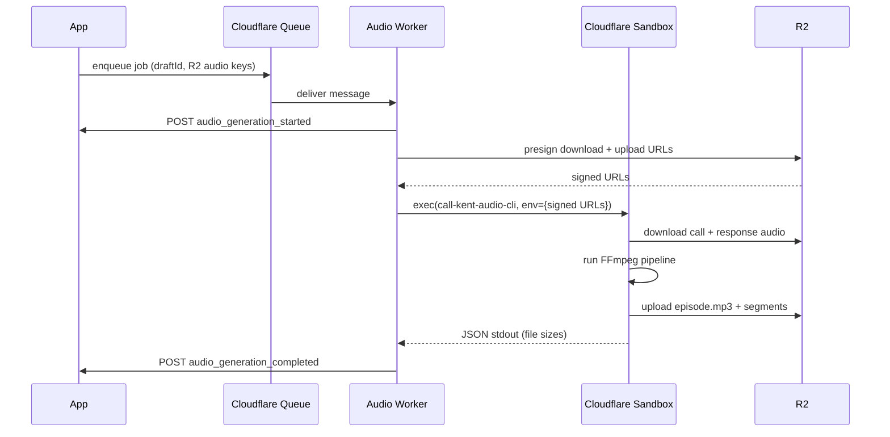

Near the end of my
[last post](/blog/offloading-ffmpeg-with-cloudflare) about moving FFmpeg off
my primary Fly.io server, I wrote:

> I really wish I didn't have to do the heartbeat dance. That would be a nice
> feature to just have built-in Cloudflare friends!

Well. Twenty-four hours later, the heartbeat dance was gone.

## Quick recap

[That post](/blog/offloading-ffmpeg-with-cloudflare) explains the full story,
but here is the short version: I was running FFmpeg inline on my primary app
server and it saturated the CPU whenever I published a longer episode. The fix
was to move the job onto Cloudflare: a queue delivers the work to a Worker,
which forwards it to a Cloudflare Container, which does the FFmpeg stitching
and uploads the outputs to R2.

That solved the production problem. But the container design had a rough edge I
wasn't happy about.

The container didn't know it was done. When the FFmpeg job finished, the
container couldn't tell Cloudflare "you can stop me now." That control lives in
the Cloudflare Worker and Durable Object wrapper, so I had to wire up heartbeat
pings from inside the container process while FFmpeg was running, plus a
"shutdown if idle" endpoint that the container called on job completion to check
whether any other jobs were active and, if not, tell the controller to stop the
container. All of that coordination plumbing existed purely to manage a
lifecycle that shouldn't need that much ceremony.

Cloudflare Sandboxes have a different model. You call `sandbox.exec()` to run a
command, wait for it to finish, and the sandbox is done. No heartbeats. No
shutdown signals. No idle checks.

## The first sandbox attempt

The day I shipped the container migration, I handed a Cursor agent the keys to
a spike: migrate the audio pipeline from Cloudflare Containers to Cloudflare
Sandboxes.

That spike became [PR #726](https://github.com/kentcdodds/kentcdodds.com/pull/726).
It worked, and it deleted the heartbeat/shutdown plumbing entirely. But when I
looked at the code (yes, I do sometimes still read the code), it still felt like
a container system wearing a sandbox costume. A wolf in sheep's clothing! 😆

The design in that PR was: a dedicated `call-kent-audio-sandbox` service with
its own Wrangler config, its own deploy workflow, and its own HTTP endpoint at
`/jobs/episode-audio`. The existing queue worker would `POST` a job to that
endpoint. The sandbox service would start a Node process inside the sandbox,
wait for a port, proxy the request to it, and run the job. The sandbox service
itself owned the callback logic and held the R2 credentials.

The heartbeat was gone, but the overall shape was the same: a long-lived service
sitting between the queue worker and the actual work.

## What the merged version actually looks like

So I closed that first attempt and started over with a new agent which turned
into [PR #729](https://github.com/kentcdodds/kentcdodds.com/pull/729). It took a
different approach. Instead of building a new service around the sandbox, it
made the sandbox an implementation detail of the existing worker.

Here is the full flow:



The queue worker is now the orchestrator. It receives the message, sends a
`started` callback, creates short-lived presigned R2 URLs for both the inputs
and the outputs, runs a single `exec()` call in a fresh sandbox, and then sends
`completed` or `failed`. The sandbox runs one shell script, exits, and is
destroyed in a `finally` block. That's it.

The key difference from PR #726 is where things live:

|                    | PR #726 (abandoned)                          | PR #729 (merged)                                  |
| ------------------ | -------------------------------------------- | ------------------------------------------------- |
| Sandbox invocation | Worker POSTs to sandbox service endpoint     | Worker calls `sandbox.exec()` directly            |
| Callback ownership | Sandbox service sends callbacks              | Worker sends callbacks                            |
| R2 credentials     | Passed into the sandbox                      | Kept in the worker; sandbox gets signed URLs only |
| Sandbox lifecycle  | Long-lived service process, port-ready check | One-shot exec, `destroy()` in `finally`           |
| Deploy surface     | Separate service + separate workflow         | Embedded in worker package                        |

The sandbox image is correspondingly tiny:

```dockerfile
FROM docker.io/cloudflare/sandbox:0.7.16

RUN apt-get update \
  && apt-get install -y --no-install-recommends ffmpeg \
  && rm -rf /var/lib/apt/lists/*

WORKDIR /opt/call-kent-audio

COPY assets ./assets
COPY sandbox/call-kent-audio-cli.sh /usr/local/bin/call-kent-audio-cli

RUN chmod +x /usr/local/bin/call-kent-audio-cli
```

The Cloudflare Sandbox base image provides the runtime. I add FFmpeg, copy the
bumper audio assets, and copy one shell script. That shell script downloads the
input audio files from presigned URLs, runs the FFmpeg stitching pipeline,
uploads the three output files to presigned upload URLs, and prints JSON to
stdout with the output file sizes. Then it exits. Nothing inside the sandbox
needs credentials, secrets, or any knowledge of the broader system.

The worker side is equally readable:

```ts
const completed = await runCallKentAudioSandboxJob({
	binding: env.Sandbox,
	sandboxId: createSandboxId(parsed.draftId),
	request: {
		draftId: parsed.draftId,
		attempt,
		callAudioUrl: signedUrls.callAudioUrl,
		responseAudioUrl: signedUrls.responseAudioUrl,
		episodeUploadUrl: signedUrls.episodeUploadUrl,
		callerSegmentUploadUrl: signedUrls.callerSegmentUploadUrl,
		responseSegmentUploadUrl: signedUrls.responseSegmentUploadUrl,
	},
})
```

And `runCallKentAudioSandboxJob` boils down to:

```ts
const sandbox = getSandbox(binding, sandboxId)
try {
	const result = await sandbox.exec('/usr/local/bin/call-kent-audio-cli', {
		env: createSandboxCommandEnvironment(request),
		timeout: sandboxExecTimeoutMs,
	})
	return getSandboxOutput(result.stdout)
} finally {
	await sandbox.destroy()
}
```

Start it, run it, destroy it. No coordination layer needed.

## How I justified moving this fast

I added Cloudflare Containers the day before and had exactly one real production
run to judge by. That is not a lot of data.

But the justification here isn't performance numbers. It's that the final system
has fewer moving parts and fewer places for things to go wrong. The control
plane I deleted (the heartbeat loop, the idle check, the shutdown signal, the
separate service with its own deploy pipeline) was complexity I was adding on
top of a problem that already had a simpler solution. A sandbox that runs one
job and exits does not need any of that. The right lifecycle for job-shaped work
is a job-shaped sandbox.

The container migration was still worth it. It solved the immediate production
problem and running on the containers version for even one day made it obvious
that the heartbeat/shutdown ceremony was the part that didn't need to exist. I
just didn't know the sandbox API well enough to see that until I'd tried the
first version.

## How long this actually took me

The container implementation, the sandbox spike (PR #726), the redesigned
sandbox approach (PR #729), the comparison between the two, and the final
validation all happened in under an hour of my own time.

I described the problem to a Cursor agent. It built the first sandbox direction.
I looked at what it built, thought "this is still shaped like a container
service," described the simpler shape I wanted, and it rebuilt it. I reviewed
the result, merged it, and moved on.

The agent handled the exploration cost. That is the part that usually makes
architectural iteration slow: you have to build the thing before you can have
an informed opinion about whether it is the right thing. When that cost is
close to zero (or the cost of the amount of tokens 😅), you can just try both
and choose the better one (or as I like to say, "choose the one I hate the
least"). The PR history here has an entire abandoned direction that I genuinely
used to inform the final design, and it cost me very time little to produce.

## What I still missed

Agents didn't catch everything. Two things only surfaced once the real system
ran.

**Sandbox ID length.** The original worker generated sandbox IDs like this:

```ts
const sandboxId = `call-kent-audio-${draftId}-${crypto.randomUUID()}`
```

A UUID is 36 characters, so this came out to roughly 89 characters. Cloudflare
Sandbox IDs must be 1-63 characters. The first real production run failed
immediately with `Sandbox ID must be 1-63 characters long.`

The fix was to keep the ID traceable but compact: strip dashes from both the
draft ID and the random suffix, take the first 12 characters of each, and
combine them:

```ts
function createSandboxId(draftId: string) {
	const compactDraftId = draftId.replaceAll('-', '').slice(0, 12)
	const randomSuffix = crypto.randomUUID().replaceAll('-', '').slice(0, 12)
	return `call-kent-${compactDraftId}-${randomSuffix}`
}
```

`call-kent-` is 10 characters, each compact segment is 12, the separator is 1,
giving a total of 35. Well under the limit, still traceable to the draft, still
unique enough.

I could have caught this by running it myself in a staging/preview
environment... or giving the agent the keys to that it for me.

**The sandbox image wasn't actually a sandbox image.** This one is a better
story.

During the PR review, one of the automated bots noted that the Dockerfile ran
as root and suggested adding a non-root user. The agent implementing that change
also set up a minimal HTTP server (`busybox httpd`) as the container entrypoint,
probably from some pattern about containers needing a running process. The
problem is that Cloudflare Sandboxes aren't containers in that sense. The
`@cloudflare/sandbox` SDK expects to talk to the Cloudflare sandbox runtime
that's baked into the base image. When I based the image on plain Debian and set
my own `CMD`, the SDK's exec session setup got 501 errors because the runtime
wasn't there.

I didn't catch this in testing because the local mock path doesn't go through a
real sandbox image at all.

Here is the cool part: I handed this debugging task to an agent. It connected to
the live production environment using real env vars, enqueued throwaway jobs
with fake draft IDs (so nothing could accidentally publish), and ran through the
actual queue-to-sandbox path in production. Within a few minutes it had isolated
the failure: the queue delivery and callback routing were fine, the worker logic
was fine, and the sandbox exec was failing with 501s. It traced that back to the
image setup, identified the missing base image requirement, and wrote the fix.

Shout-out to [the Cloudflare MCP server 🔥](https://blog.cloudflare.com/code-mode-mcp/).

I got a summary back describing exactly what was wrong and what was changed. I
looked at the diff, the explanation made sense, and I merged it. The next
production probe succeeded and produced the expected MP3 outputs in R2.

That is genuinely cool. Not "AI wrote code" cool, which at this point is table
stakes. I mean "I delegated a real production debugging investigation, the agent
ran it safely without my supervision, and I got back a correct diagnosis and
fix" cool. I did not spend an evening poking at logs. I did not have to
reconstruct the failure path manually. I just reviewed the result and moved on.

The fixed Dockerfile is now six lines:

```dockerfile
FROM docker.io/cloudflare/sandbox:0.7.16

RUN apt-get update \
  && apt-get install -y --no-install-recommends ffmpeg \
  && rm -rf /var/lib/apt/lists/*

WORKDIR /opt/call-kent-audio
COPY assets ./assets
COPY sandbox/call-kent-audio-cli.sh /usr/local/bin/call-kent-audio-cli
RUN chmod +x /usr/local/bin/call-kent-audio-cli
```

The official base image handles the sandbox runtime. I add FFmpeg and the
assets. Nothing else.

## The monorepo wrinkle

One thing I'm not covering in detail here: all of this sandbox work happened on
the same day I also migrated the repo to npm workspaces and Nx, which moved
everything under `services/*`. That migration had its own production incident
involving hardcoded content paths and a broken Docker stage.

I wrote about all of that separately in
[Migrating to Workspaces and Nx](/blog/migrating-to-workspaces-and-nx). The
short version is: structural refactors break assumptions you didn't know you
had, and "the agent was confident it would work" is not the same as "it will
work."

I only really mention this to say that I never could have gotten so much done at
once before agents. I love building software in 2026!

## What I'd take away from this

New infrastructure primitives only help if you let them change the shape of the
thing you're building. Cloudflare Sandboxes let me delete a lifecycle control
plane that the container approach required but sandboxes simply don't need. The
win wasn't "sandboxes are faster" or "sandboxes are cheaper" (I don't have
enough data to make those claims after two days). The win was that the right
design for a one-shot job is a one-shot execution model, and the sandbox API
makes that straightforward.

The container migration fixed the production problem. The sandbox migration
fixed the architectural shape that was left behind. Both were worth doing, and
together they cost me about an hour of my own time.

If you want to hear more about any of this, [give me a call](/calls).
